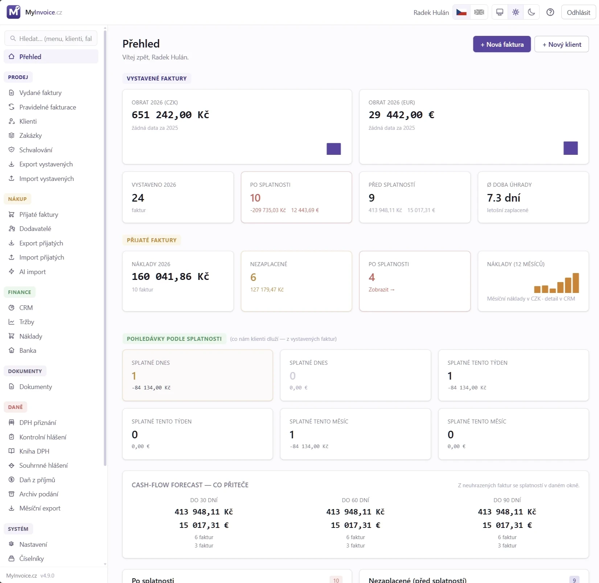
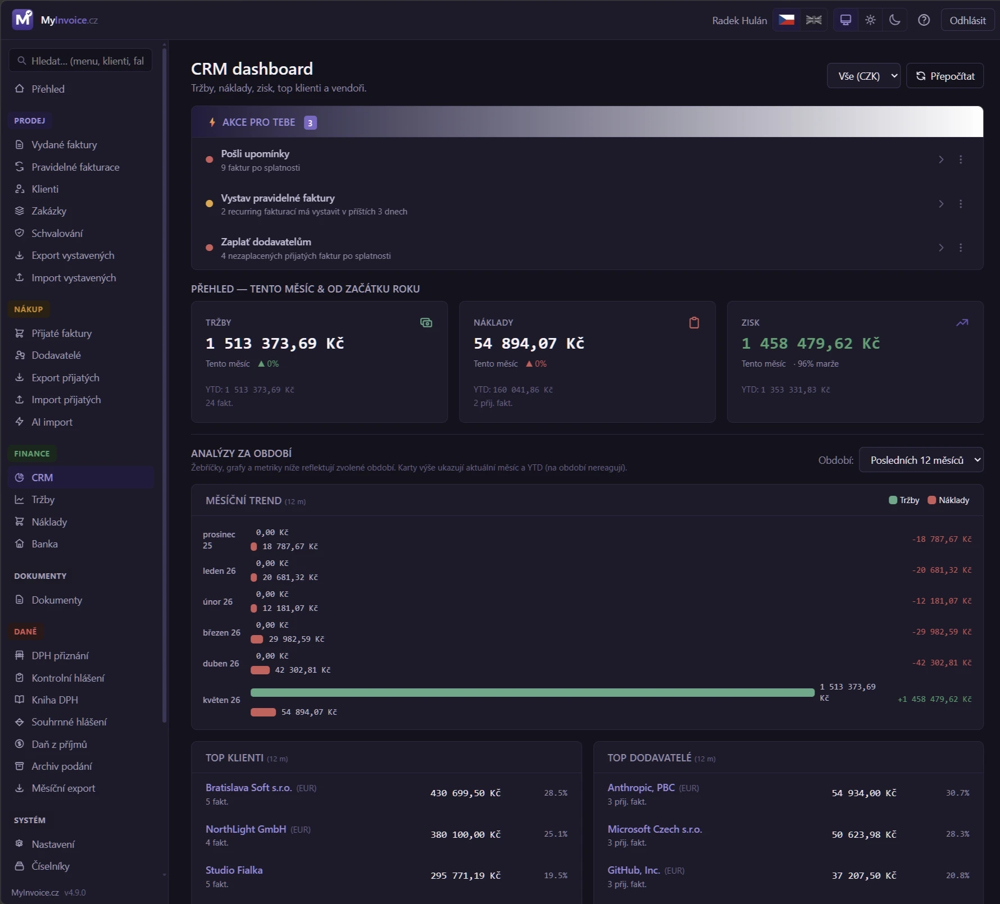

# MyInvoice.cz

[](LICENSE)
[](https://www.php.net/)
[](https://mariadb.org/)
[](https://vuejs.org/)
[](https://github.com/radekhulan/myinvoice/pkgs/container/myinvoice)
[](https://github.com/radekhulan/myinvoice/pkgs/container/myinvoice)

---

# ⭐ Doporučujeme přejít na MyÚčto.cz

> ## 👉 **[github.com/radekhulan/myucto](https://github.com/radekhulan/myucto)**
>
> **MyÚčto.cz je nástupce MyInvoice a doporučená volba pro novou instalaci
> i pro další vývoj.**
>
> ### Všechno z MyInvoice v něm zůstává navždy zdarma
>
> Kompletní funkcionalita MyInvoice — vystavené i přijaté faktury, AI extrakce
> PDF, CRM dashboard, dokumenty, banka a QR platby, výkazy DPH / KH / SH, daň
> z příjmů, multi-supplier, REST API, exporty pro účetní — je v MyÚčto
> **bezplatná a plně použitelná i bez jakékoli licence**, včetně pořizování
> a úprav dat. Žádné omezení počtu faktur, klientů ani firem.
>
> ### A navíc řada funkcí na volitelné komerční bázi
>
> | Modul | Co přidává |
> |---|---|
> | **Podvojné účetnictví** | Účtový rozvrh s analytikami, předkontace, automat účtování, účetní deník s verzováním a hash-řetězenou auditní stopou, hlavní kniha, obratová předvaha, saldokonto. |
> | **Účetní nástroje a uzávěrka** | Účetní období, závěrková mapa K1–K10, kontrolní sestavy a inventarizace, časové rozlišení, dohadné položky, rezervy a odložená daň, rozvaha a výsledovka v druhovém i účelovém členění, přehled o peněžních tocích a o změnách vlastního kapitálu, příloha k závěrce. |
> | **Evidence majetku** | Karty majetku, daňové i účetní odpisy, drobný a nehmotný majetek, vazba zůstatkové ceny na daň z příjmů. |
> | **Sklad a e-shop** | Skladové karty a pohyby, příjemky a výdejky, inventury, automatická výdejka při fakturaci, cenotvorba a marže, napojení e-shopu. |
> | **EPO podání a archív** | Přímé podání na finanční správu podepsané kvalifikovaným certifikátem, oficiální zkušební režim, archiv snapshotů s doručenkami a daňová rekonciliace. |
> | **Rozšířené opravy DPH** | Oprava výše daně (§ 43), nedobytné pohledávky (§ 46), úprava odpočtu u dlouhodobého majetku (§ 78–78e), odpočet při registraci a snížení při zrušení (§ 79 / 79a), režim § 74b. |
>
> Celý komerční rozsah lze po instalaci **60 dní zdarma a bez registrace
> vyzkoušet**. Po skončení licence zůstává bezplatná část plně funkční —
> nedostupná je pouze vyjmenovaná nadstavba, jejíž data zůstávají nedotčená
> ve vaší databázi a po opětovné aktivaci se znovu zpřístupní.
>
> ### Vývoj pokračuje tam
>
> MyÚčto sdílí s MyInvoice společný základ i historii v gitu a aktivně z něj
> přebírá změny. **Nové funkce, opravy i pull requesty směřujte prosím do
> [MyÚčto](https://github.com/radekhulan/myucto)** — dostanou se tak k oběma
> projektům. MyInvoice zůstává funkční a udržovaný, ale těžiště vývoje se
> přesunulo.
>
> 🌐 [MyÚčto.cz](https://myucto.cz/) · 📖 [Manuál](https://myucto.cz/manual/)

---

### Fakturace pro freelancery, OSVČ a malé firmy. Vaše data, váš server.

**Český open-source fakturační systém, který běží u vás.** Vystavené i přijaté
faktury, AI extrakce z PDF, CRM dashboard s cash-flow předpovědí, výkazy DPH,
kontrolní a souhrnné hlášení, daň z příjmů v podobě EPO XML, QR platby, import
bankovních výpisů, REST API a exporty pro účetní software. Žádný SaaS, žádné
měsíční poplatky, žádné limity na počet dokladů.

Vyvíjí **[MyWebdesign.cz s.r.o.](https://mywebdesign.cz/)**

🌐 [MyInvoice.cz](https://myinvoice.cz/) ·
📖 [Online manuál](https://myinvoice.cz/manual/) ·
🏢 [MyWebdesign.cz s.r.o.](https://mywebdesign.cz/)



> ⚠️ **Než začnete fakturovat, přečtěte si
> [Fakturujeme — daňový průvodce](manual/28_Fakturujeme.md).** Vysvětluje, jak
> aplikace pracuje s plátci a neplátci DPH, sazbami a reverse charge, kde má
> limitace (například automatické posouzení OSS nebo IOSS) a jak je řešit.
> **Správnost faktury je vždy na uživateli** — pro nestandardní situace
> konzultujte účetní.

---

## Proč MyInvoice

- **Data patří vám.** Vše běží na vlastním nebo pronajatém serveru — aplikace,
  databáze i doklady. Žádný cloud, žádné přesouvání fakturace k třetí straně.
- **Multi-supplier od první verze.** Fakturujte za libovolný počet firem a IČO
  z jedné instalace, s izolovanými daty a přepínačem v horní liště.
- **Český kontext na prvním místě.** ARES a VIES lookup, SPAYD QR pro CZK
  i SEPA EPC pro EUR, ISDOC 6.0.2 a Pohoda XML, mod-11 validace bankovních
  účtů, GPC import výpisů.
- **Nulové měsíční náklady.** Jednorázový setup, žádné poplatky za fakturu,
  žádné limity.
- **AI vytěžuje, člověk rozhoduje.** AI přečte naskenovanou fakturu a předvyplní
  doklad, potvrzení ale zůstává na uživateli.

## Přehled funkcí

Každý modul má vlastní kapitolu manuálu — odkazy vedou na detail.

| Modul | Co pokrývá |
|---|---|
| **Vystavené faktury** | Faktura, zálohová (proforma), opravný daňový doklad a interní storno. Vystavení dokladu z proformy s odečtem zálohy, klonování s auto-inkrementem období, hromadné akce, PDF se snapshotem stran (neměnný doklad). |
| **Výkaz víceprací** | Druhá strana PDF s přenosem sumy do položky a volitelné **schvalování zákazníkem přes e-mailový odkaz** — token + CAPTCHA, jedním klikem schválení a automatické vystavení faktury. |
| **Přijaté faktury** | Dodavatelé jako role v evidenci klientů (jedna firma může být odběratel i dodavatel), lifecycle draft → received → booked → paid, multi-currency s kurzem ČNB a kurzovými rozdíly, PDF archiv se SHA-256 dedupe. |
| **Inteligentní import** | [AI extrakce PDF](manual/24_AI_extrakce.md) přes Anthropic Claude (BYOK), ISDOC uvnitř PDF, Pohoda XML, synchronizace z iDokladu a Fakturoidu, hlídaný inbox adresář, tříúrovňový lookup dodavatele proti duplicitám. |
| **CRM dashboard** | KPI tržby / náklady / zisk s trendem, denní „akce pro tebe“, aging pohledávek i závazků, DSO a platební morálka, cash-flow forecast na 4 týdny, Pareto koncentrace klientů a dodavatelů. |
| **Dokumenty** | Úložiště se stromem složek, tagy a fulltextem v obsahu (PDF, Office, XML). Nahrávání celých adresářů, dvojí režim ZIP, rozbalení ZFO datových zpráv včetně příloh a P7S podpisů, oboustranné párování na doklady, koš s obnovou. |
| **Platby a banka** | QR platby v PDF (SPAYD pro CZK, SEPA EPC pro EUR), import GPC výpisů (KB, FIO, ČSOB, RB, ČS) se SHA-256 dedupe, automatické párování podle VS a částky, upomínky po splatnosti. |
| **Klienti a zakázky** | ARES a VIES lookup, dual-role firmy, zakázky 1:N pod klientem, fakturační e-maily per zakázka, reverse charge přepínatelný per klient, ochrana proti smazání navázaných dokladů. |
| **Multi-supplier** | Libovolný počet firem z jedné instalace, izolovaná data a číselné řady, vlastní měny, bankovní účty, logo, podpis, SMTP identita a Pohoda kódy per firma, AI klíč per firma. |
| **Výkazy DPH a daně** | [Přiznání k DPH](manual/32_Vykazy_DPH.md), kontrolní hlášení, souhrnné hlášení, kvartální OSS přehled, DPFO pro OSVČ a DPPO. XML pro EPO portál s XSD validací a archivem podání. |
| **Exporty pro účetní** | Hromadný export PDF po měsících, [ISDOC 6.0.2](manual/26_Export_prijatych.md) validovaný proti oficiálnímu XSD, Pohoda XML data package s konfigurací kódů per firma. |
| **REST API v1** | 101 endpointů pod `/api/v1/*`, osobní přístupové tokeny s per-token scope, OpenAPI 3.1 se Swagger UI a Redoc, rate limit 600 req/min. |
| **Komunikace** | Odesílání faktur e-mailem přes Symfony Mailer s podporou DKIM, editor Twig šablon v UI (CZ i EN, HTML i plaintext), branding odesílatele per firma. |
| **Bezpečnost** | Brute-force ochrana, Cloudflare Turnstile, IP allowlist, CSRF a Origin check, TOTP 2FA (volitelně vynucená), peppered bcrypt, AES-256-GCM šifrování citlivých polí, RBAC a activity log. |



## Rychlý start

Nejrychlejší cesta k běžící aplikaci vede přes připravený multi-arch Docker
image. Nepotřebujete lokálně PHP, MariaDB ani Node.

```bash
git clone https://github.com/radekhulan/myinvoice.git
cd myinvoice

cmd/docker-ghcr.sh          # Linux / macOS
.\cmd\docker-ghcr.ps1       # Windows PowerShell
```

Skript vygeneruje `.env` s náhodnými hesly, připraví `cfg.docker.php`, stáhne
image z GHCR, spustí stack a provede migrace. Po dokončení otevřete
[http://localhost:8080](http://localhost:8080) — naskočí **setup wizard**, který
založí administrátora, první firmu s načtením údajů z ARES, bankovní účet
a volitelně ukázková data.

**Aktualizace:**

```bash
cmd/docker-update.sh        # Linux / macOS
.\cmd\docker-update.ps1     # Windows PowerShell
```

Zachová volumes s daty, stáhne nový image a doběhne čekající migrace. Nový image
se publikuje automaticky při každém release tagu.

> **WSL2 / Linux po klonu:** pokud `./cmd/docker-ghcr.sh` hlásí `Permission
> denied` nebo `/usr/bin/env: 'bash\r'`, má váš git zapnutý `core.autocrlf=true`.
> Jednorázová oprava: `sed -i 's/\r$//' cmd/*.sh && chmod +x cmd/*.sh &&
> git config --global core.autocrlf input`.

Build ze zdrojáků (`cmd/docker-install.{sh,ps1}`), instalace bez klonování repa
a upgrade přímo z UI včetně update watcheru jsou popsané v kapitole
[Instalace Dockerem](manual/03_Instalace_Docker.md).

### Nativní instalace

Podporované prostředí:

| Součást | Požadavek |
|---|---|
| PHP | 8.5+ s PDO MySQL, mbstring, OpenSSL, JSON, iconv a GD |
| Databáze | MariaDB 10.6+ (doporučeno 11.x) |
| Web server | IIS nebo Apache (konfigurace pro oba je součástí repa) |
| Frontend build | Node.js 22+ a pnpm 10+ |
| Backend build | Composer 2 |
| Redis | volitelný; systém má fallback na MariaDB MEMORY |

```bash
git clone https://github.com/radekhulan/myinvoice.git myinvoice
cd myinvoice
cp cfg.sample.php cfg.php          # doplň db, app.pepper, smtp, captcha
mysql -u root -p -e "CREATE DATABASE myinvoice CHARACTER SET utf8mb4 COLLATE utf8mb4_unicode_ci;"
cd api && composer install && cd ..
php api/bin/migrate.php
cd web && pnpm install && pnpm build && cd ..
php tools/generateManualHtml.php
php tools/exportManualToPdf.php
```

Databázové změny spouštějte vždy přes `php api/bin/migrate.php`, nikdy migrační
SQL ručně. Detailní postup je v kapitole
[Nativní instalace](manual/04_Instalace_Nativni.md).

Pro hosting bez Composeru a Node je u každého release připravený **production
bundle** s hotovými `api/vendor/`, `web/dist/` i vygenerovaným manuálem.

## CLI nástroje

```bash
php api/bin/migrate.php                    # spustí pending migrace
php api/bin/migrate.php --status           # vypíše stav migrací
php api/bin/setup.php                      # interaktivní úvodní zřízení
php api/bin/sample.php                     # vygeneruje testovací data
php api/bin/reset.php                      # smaže všechna user-data (vyžaduje potvrzení)
php api/bin/reset-2fa.php <email>          # nouzově vypne 2FA uživateli
php api/bin/recompute-stats.php            # přepočítá agregované statistiky
php api/bin/cron-scan-purchase-inbox.php   # import ISDOC/PDF z inbox adresáře
```

Cron wrappery pro Windows i Linux jsou v `cmd/` — scan bankovních výpisů,
upomínky, čištění, scan inboxu, záloha PDF a denní kontrola nové verze. Jejich
zdraví a poslední běh sleduje UI v **Systém → Plánované úlohy**.

## Bezpečnost

Brute-force ochrana s CAPTCHA a lockoutem, volitelný IP allowlist, CSRF a Origin
check, TOTP 2FA (volitelně vynucená pro všechny), peppered bcrypt hesla,
AES-256-GCM šifrování citlivých polí, RBAC, activity log všech mutací,
path-traversal guardy odolné vůči casingu Windows, sanitizace XML a bezpečný
upload podle skutečného MIME.

Bezpečnostní chybu **neoznamujte veřejným ticketem.** Použijte formulář na
[MyWebdesign.cz](https://mywebdesign.cz/) s předmětem `[SECURITY] MyInvoice.cz`
a postup v [SECURITY.md](SECURITY.md).

## Technologický základ

| Vrstva | Technologie |
|---|---|
| Backend | PHP 8.5, Slim 4, PHP-DI 7, Twig 3, Monolog 3, Guzzle 7 |
| Frontend | Vue 3, TypeScript, Vite, Tailwind 4, Pinia, vue-router, vue-i18n |
| Databáze | MariaDB 10.6+ (doporučeno 11.x) |
| PDF / e-mail | mPDF + Twig, Symfony Mailer (SMTP, DKIM) |
| QR platby | SPAYD (CZK), SEPA EPC (EUR) |
| Cache | Redis (preferováno) nebo MariaDB MEMORY fallback |
| API | REST API v1, OpenAPI 3.1 |
| Testy | PHPUnit 13, PHPStan 2, php-cs-fixer, vue-tsc |
| Provoz | IIS, Apache nebo Docker |

Pokud chybí `cfg.php` nebo není dostupná databáze, frontend i API vrací **503
s instrukcemi** místo bílé stránky.

## Dokumentace

Uživatelský manuál pokrývá celý pracovní cyklus ve 39 kapitolách řazených podle
menu aplikace — od instalace přes vystavené i přijaté faktury, finanční přehledy
a dokumenty až po výkazy DPH, systémová nastavení a REST API. Po instalaci je
dostupný na `/manual` s fulltextem a ke stažení v PDF. Zdroj je v `manual/*.md`.

**Vývojářská specifikace** je v [`source/`](source/00-README.md) — funkční
a technická spec, DB schéma, architektura, REST API, design system, roadmapa
a bezpečnostní audit.

### Struktura repozitáře

| Adresář | Obsah |
|---|---|
| `api/` | PHP backend, služby, repository, CLI a PHPUnit testy |
| `web/` | Vue 3 + TypeScript frontend |
| `dist/` | produkční build frontendu (commitovaný) |
| `db/migrations/` | číslované idempotentní SQL migrace |
| `manual/` | uživatelský manuál v Markdownu |
| `source/` | vývojářská spec a plány |
| `tools/` | generování manuálu a pomocné převody |
| `cmd/` | cron a deploy wrappery pro Windows i Linux |

### Vývoj a ověření

```bash
# Backendové testy
cd api && php vendor/bin/phpunit

# Frontendová typová kontrola a build
cd web && pnpm build
```

## Přispívání

**Nové funkce a opravy prosím směřujte do
[MyÚčto](https://github.com/radekhulan/myucto)** — sdílí s MyInvoice společný
základ, takže se změna dostane k oběma projektům, a je to místo, kde vývoj
aktivně pokračuje. Pravidla pro přispěvatele i AI agenty jsou v
[AGENTS.md](AGENTS.md).

Pro testy platí tvrdé pravidlo: **pouze syntetická data.** Repozitář je veřejný,
takže žádné reálné doklady, výpisy, IBANy ani identifikátory skutečných
protistran.

## Licence

**MIT** — [LICENSE](LICENSE). Můžete zdarma používat, upravovat i redistribuovat
včetně komerčního použití. Jediná podmínka je zachovat copyright a text MIT
licence v derivátech.

Vyvíjí **[MyWebdesign.cz s.r.o.](https://mywebdesign.cz/)** © 2026.

## Podpora autora

Líbí se vám projekt? Autora můžete podpořit darem:

- **Účet:** `7700000038 / 6363` (Partners Banka)
- **IBAN:** `CZ21 6363 0000 0077 0000 0038`
- **BIC / SWIFT:** `PTBNCZPP`


Děkujeme!

## Zřeknutí se odpovědnosti

> **Software je poskytován „TAK JAK JE", bez záruky jakéhokoli druhu**,
> výslovné nebo předpokládané, včetně, ale nikoliv pouze, záruk
> obchodovatelnosti, vhodnosti pro určitý účel a neporušení práv třetích osob.
>
> **Použití této aplikace je výhradně na vlastní riziko uživatele.**
> Autoři ani přispěvatelé v žádném případě neodpovídají za jakékoli přímé,
> nepřímé, náhodné, zvláštní, exemplární či následné škody (mimo jiné za
> ztrátu dat, ušlý zisk, výpadek provozu nebo poškození pověsti) vzniklé
> v souvislosti s používáním nebo nemožností použití tohoto softwaru,
> a to ani v případě, že byli o možnosti takových škod informováni.
>
> Aplikace zpracovává **fakturační a účetní data** — uživatel je výhradně
> odpovědný za:
> - **správnost vystavených dokladů** podle platné legislativy ČR a EU
>   (zákon o DPH, zákon o účetnictví, GDPR a další);
> - **zálohování databáze a souborů** v `storage/`;
> - **zabezpečení produkčního nasazení** (HTTPS, IP allowlist, 2FA, silná
>   hesla, pravidelné aktualizace závislostí);
> - **dodržení daňových a archivačních povinností** (ČR: 10 let pro
>   účetní doklady).
>
> Plné znění viz [LICENSE](LICENSE) (MIT — sekce *„NO WARRANTY"*).
